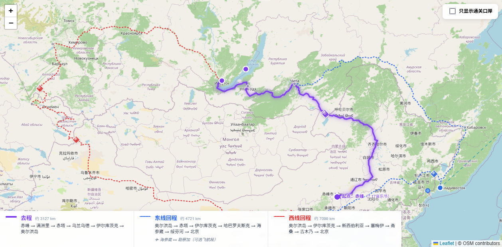

# 浪浪虎 — 路线规划到交互地图

一个将旅行路线规划（自驾/骑行/徒步/摩托）转化为交互式 Leaflet 地图的 Skill。

## 文件结构

```
langlang-tiger/
├── SKILL.md                    # Skill 定义文件（安装后由 WorkBuddy 加载）
├── examples/
│   ├── index.html              # 示例：贝加尔湖自驾路线地图（单文件即开即用）
│   └── map-screenshot.png      # 示例截图
└── README.md                   # 本文件
```

## 示例

### 贝加尔湖自驾路线

从赤峰出发，经满洲里出境，自驾至贝加尔湖（奥尔洪岛），返程可选东线（经海参崴，含勘察加飞航段）或西线（经新西伯利亚、哈萨克斯坦）。

**在线预览：** https://513e84b52fcd4db29f414aa873cf3ef9.app.codebuddy.work

**本地使用：** 直接打开 `examples/index.html` 即可在浏览器中查看完整交互地图。

### 截图



## 功能特性

- 🗺️ 交互式 Leaflet 地图，路线沿实际道路绘制（非直线）
- 🎨 三色路线对比：去程/返程分支，支持实线/点状虚线/长虚线
- 🏷️ 关键节点分类：口岸/补给/城市/景观/风险，支持分组筛选
- 📊 底部图例栏：色块+名称+距离+详细路径
- 🔍 细腻缩放（1/5 级步长）
- ✈️ 飞航段/轮渡等交通切换节点
- 🌐 一键部署到 CloudStudio（免费）

## 适用场景

- 出境/境内自驾路线规划
- 摩托骑行/自行车骑行路线
- 徒步穿越路线
- 多方案路线对比
